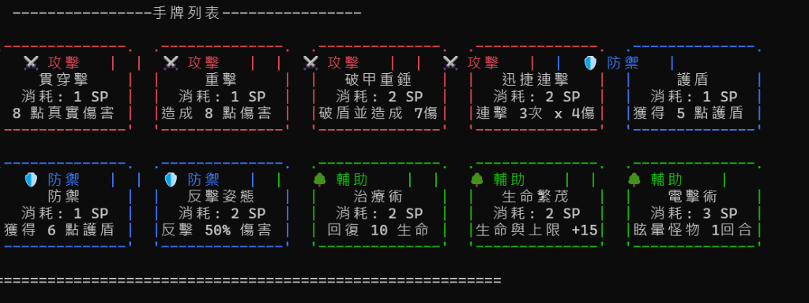
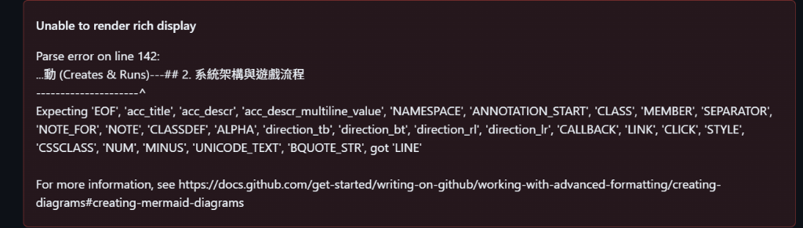

# 🛡️ C++ Card RPG 遊戲框架 — 專題開發報告 (Project Report)

---

## 📋 專案基本資訊

* **專案名稱**：傳奇勇者：卡牌冒險 (Legend of Card Hero)
* **課程名稱**：物件導向程式設計專題 (Object-Oriented Programming Project)
* **開發環境**：C++11 標準、MinGW-g++、Windows 虛擬終端控制台 (VT100)
* **GitHub 倉庫網址**：[https://github.com/Louiss924/C-Project_RPG](https://github.com/Louiss924/C-Project_RPG)

---

# 📖 第一部分：遊戲設計與功能說明

## 1. 遊戲核心玩法 (Core Gameplay)
本專案為單人卡牌建構 (Deckbuilding) 回合制戰鬥 RPG。玩家扮演一名傳奇勇者，擁有一套由多種功能牌組成的牌庫，必須歷經兩大關卡，擊敗各式魔物與最終 Boss 烈焰巨龍：
* **關卡結構**：共 2 大關卡 (Level 1-2)，每大關有 3 回合 (Round 1-3)，第 3 回合為 Boss 戰。
* **資源系統**：
  - **HP (生命值)**：最大上限為 80。歸 0 時判定遊戲結束。
  - **SP (能量值)**：每回合出牌需消耗對應 SP。每回合打出卡牌或使用「普通攻擊」行動會回復 2 點 SP。
  - **Armor (護盾值)**：打出防禦牌時獲得，用以抵扣怪物攻擊傷害。護盾每回合會歸 0。
  - **反擊狀態**：打出反擊牌時附加，能將下回合受到傷害的 50% 反彈回魔物。

## 2. 物件導向特性：類別繼承設計 (C++ Class Inheritance)
專案核心戰鬥角色採用了物件導向中的**繼承與多型**設計：
* **基底類別 `Character`**：管理共用狀態（名稱、生命值、護盾值、眩暈標記）與基礎虛擬函式（受傷計算 `takeDamage`、回合重置 `resetTurnState`）。
* **衍生類別 `Player`**：繼承自 `Character`，擴充了 SP 能量池、手牌排序系統、牌組（`deck`、`hand`、`discardPile`）的操作方法，並覆寫 (Override) 了 `resetTurnState`（回合結束時護盾清零與反擊狀態重置）。
* **衍生類別 `Monster`**：繼承自 `Character`，擴充了隨機滾動招式意圖的方法 (`rollIntent`) 與特殊的行動計數器。

## 3. 存檔與相容系統 (Save & Load System)
* 系統在**每場戰鬥開始前與結束後**會自動執行 `saveGame()`，將當前關卡、回合、角色血量、最大血量上限、累計時間、總回合數、眾神指引選擇，以及玩家的三個卡牌容器序列化寫入 `save.dat` 檔案中。
* 讀檔 `loadGame()` 具備強健的**向下相容性**，能相容未加入最新功能旗標的舊存檔，防止玩家因為專案迭代升級而導致舊存檔損毀無法讀取。

---

# 🖼️ 第二部分：程式執行檔畫面截圖與說明

以下為程式在 Windows 控制台 (cmd/PowerShell) 執行時的實際畫面與詳細說明：

### 1. 戰鬥操作與卡牌種類標籤介面



* **畫面說明**：
  - **怪物的意圖預告**：畫面最上方清晰預告怪物下回合將採取的動作（例如：招式名稱「火球噴射」、預計傷害及描述）。玩家可據此調整出牌策略（防禦、治療或全力強攻）。
  - **角色狀態與 ASCII 圖案**：中間呈現精緻的魔物 ASCII Art 以及雙方當前的血量條 (HP) 與狀態標籤。
  - **色彩化卡牌種類邊框**：最下方為玩家手牌區，卡牌以「攻擊型 ➡️ 防禦型 ➡️ 輔助型」自動分類排序，並根據種類顯示 ANSI 彩色標籤與邊框（例如：⚔️ 攻擊、🛡️ 防禦、🌳 輔助），選取卡牌時會有金黃色亮顯框，介面極具層次感。
  - **鍵盤控制說明**：支援 `↑/↓` 方向鍵移動選取，`Enter` 鍵出牌，操作簡單直覺。

---

### 2. 最終 BOSS 蓄力警告與「眾神的指引」爆擊日誌



* **畫面說明**：
  - **烈焰巨龍「毀天滅地」蓄力特效**：在第二關最終 Boss 戰第 3 回合，Boss 會蓄力準備發動即死招式「毀天滅地」（造成 `9999` 真實傷害）。此時，畫面的巨龍 ASCII Art 會觸發**紅黃交替閃爍的視覺特效**，警告玩家必須在該回合使用「電擊術」眩暈中斷 Boss 行動。
  - **「凡人意志」與「眾神指引」爆擊日誌**：戰鬥紀錄日誌會即時印出玩家在該關卡觸發的被動加值效果（如爆擊判定、聖光加成等），增加戰鬥的臨場打擊回饋感。

---

# 🚀 第三部分：GitHub 程式碼與版本管理

本專案採用了嚴謹的 Git 分支開發流程，並已成功將所有最新的完整功能推送至 GitHub 主分支：
* **主倉庫連結**：[Louiss924/C-Project_RPG](https://github.com/Louiss924/C-Project_RPG)
* **主分支 (main)**：包含所有已編譯測試通過的 C++ 源碼 (`src/`)、標頭檔 (`include/`)、說明文件、以及架構圖與類別圖的原始 Mermaid 檔案。

您可以使用以下指令快速複製並編譯本專案：
```bash
# 複製專案
git clone https://github.com/Louiss924/C-Project_RPG.git
cd C-Project_RPG

# 編譯專案 (Windows MinGW 環境下)
g++ src\*.cpp -Iinclude -o game.exe

# 執行遊戲
.\game.exe
```
