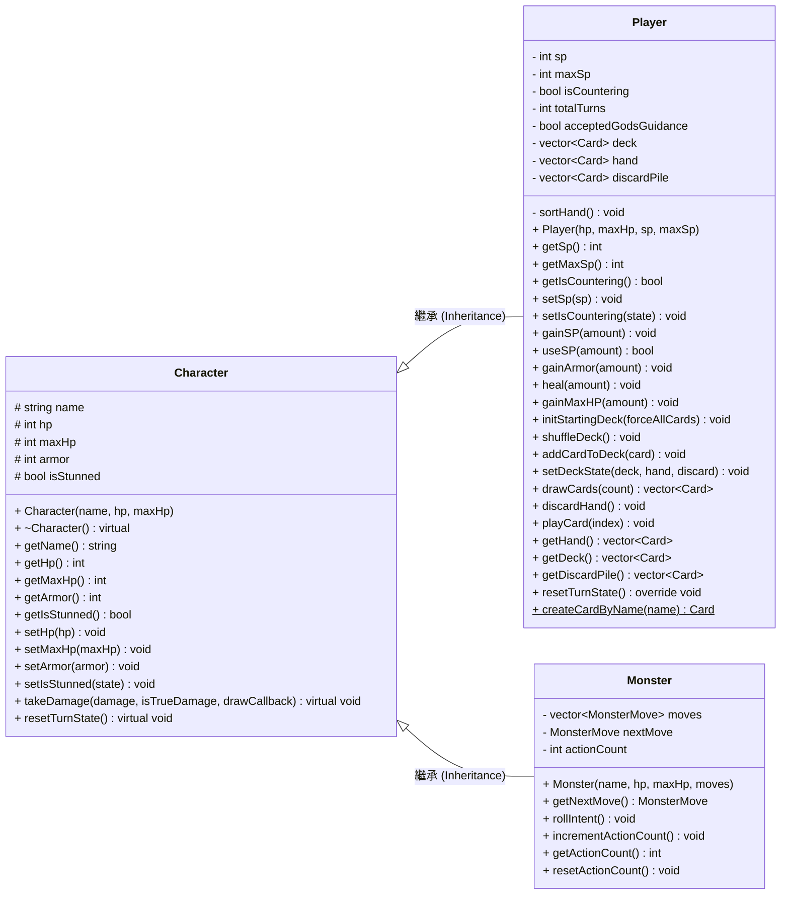
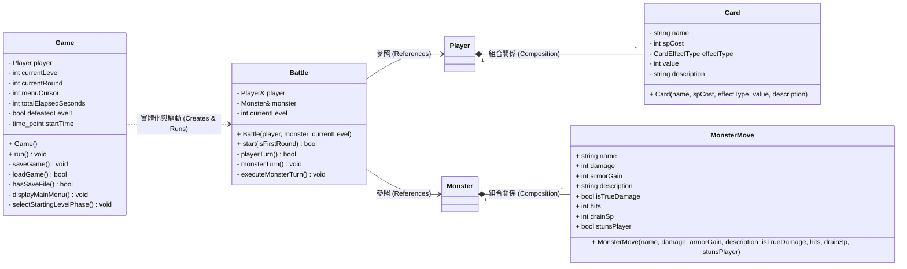
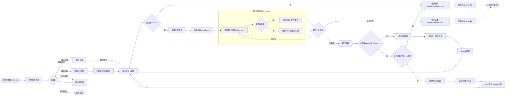

# 傳奇勇者：卡牌冒險 (Legend of Card Hero) - 系統架構與類別設計圖

本文件提供專案的**類別關係圖 (UML Class Diagram)**與**系統架構流程圖 (System Architecture & Game Flow)**，協助您在專題報告、簡報與 Demo 中清晰展現 C++ 專案的物件導向結構與執行邏輯。

為適應橫向簡報 (16:9) 與報告排版，類別圖已模組化拆分，流程圖已調整為由左至右之橫向展開版。

---

## 1. 類別關係圖 (UML Class Diagram)

### 模組 1：角色繼承架構 (Character Inheritance)
*本圖聚焦於專案核心的角色繼承關係，展現 C++ 物件導向的多型與繼承特色。*

### 模組 2：戰鬥與卡牌聚合關係 (Combat & Systems)
*本圖展現了主程式、戰鬥引擎、卡牌與怪物的關係，展示組合 (Composition) 與依賴 (Dependency) 設計。*

---

## 2. 系統架構與遊戲流程圖 (System Architecture & Game Flow)

